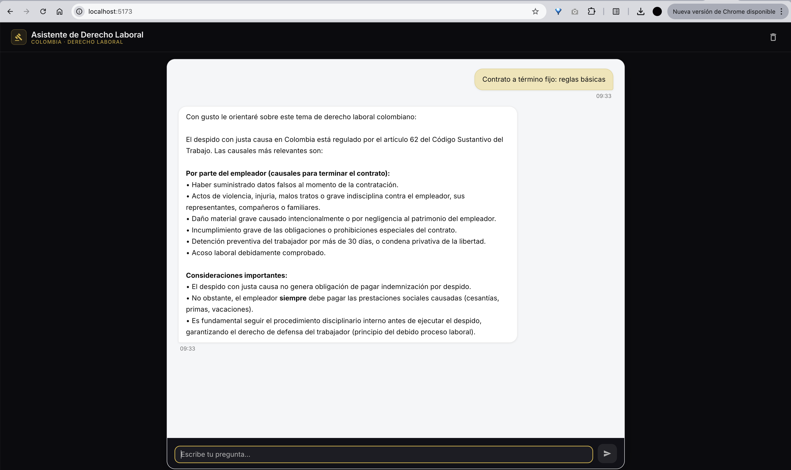

# AI Labor Law Assistant

An intelligent chatbot powered by Retrieval-Augmented Generation (RAG) that provides guidance and answers questions about Colombian labor law, as well as general questions.

## 📋 Overview

This project implements a conversational AI assistant specialized in Colombian labor legislation. Using RAG technology and intelligent intent classification, the chatbot can:
- **Answer labor law questions**: Retrieves relevant legal information from a curated knowledge base and generates accurate, contextual responses about labor rights, employment regulations, and legal procedures in Colombia.
- **Answer general questions**: Handles general queries outside the labor law domain using a general-purpose language model.

## 🖼️ Screenshots & Demo

### Chat Interface



> The assistant answering a question about fixed-term contracts and just-cause dismissal in Colombian labor law, with structured, citation-ready responses.

### Demo Video

A full walkthrough of the assistant in action is available as a screen recording:

**[▶ Watch demo.mov](examples/demo.mov)**

---

## ✨ Features

- 💬 Interactive chat interface for labor law queries and general questions
- 🧠 Intelligent intent classification (labor law vs. general questions)
- 🔍 RAG-based retrieval of relevant legal documents and articles for labor law queries
- 🌐 General question answering capabilities using state-of-the-art language models
- 📚 Knowledge base of Colombian labor legislation
- 🎯 Contextual responses with legal references and citations
- 💾 Conversation history management across sessions
- 🔄 Real-time chat interface with modern UI components

## 🏗️ Architecture

The system consists of:
- **Intent Classifier**: Uses LangGraph to classify user questions as labor law queries or general questions
- **Multi-node Agent Flow**: Routes labor-law queries through specialized nodes (`domainSearch`, `summarize`, `compare`, `draftDocument`) and validation
- **RAG Pipeline**: For labor law queries, performs dynamic retrieval from ChromaDB and generates grounded answers with citations
- **General Q&A**: Handles general questions with direct LLM responses
- **Vector Database**: Stores embeddings and legal chunks in persistent ChromaDB collections
- **LLM Integration**: Generates natural language responses using Groq and Gemini APIs
- **Legal Tools Layer**: Enables law/article lookup, jurisprudence support, citation checks, and labor-risk evaluation
- **Chat Interface**: Modern React-based UI with TypeScript and Vite
- **Conversation Memory**: In-memory conversation history with persistent conversation IDs

## 🛠️ Tech Stack

### Backend
- **LLM**: Groq (llama-3.1-8b-instant), with support for Google Gemini
- **Framework**: LangGraph 0.2.0+ for AI agent workflows
- **Vector Database**: ChromaDB (persistent local storage)
- **Backend**: FastAPI with Uvicorn
- **Programming Language**: Python 3.11+
- **Embeddings**: Google Generative AI embeddings (`models/gemini-embedding-001`) for ingestion/retrieval, with configurable provider support
- **Additional Libraries**: Pydantic, LangChain, httpx

### Frontend
- **Framework**: React 18 with TypeScript
- **Build Tool**: Vite
- **UI Components**: Radix UI, Material-UI (MUI)
- **Styling**: Tailwind CSS, Emotion
- **State Management**: React useState and localStorage for conversation persistence

## 📚 Data Sources

- Colombian Labor Code (Código Sustantivo del Trabajo)
- Complementary Colombian labor norms and legal documents ingested from the project corpus
- Document processing pipeline: PDF extraction, cleaning, semantic chunking, embeddings, and persistent indexing in ChromaDB

## 🚀 Getting Started

### Prerequisites

- Python 3.11 or newer
- Node.js 18+ and npm
- Git

### Installation

```bash
# Clone the repository
git clone <repository-url>
cd spe-ai-labor-law-assistant
```

### Backend Setup

```bash
# Navigate to the RAG backend directory
cd rag

# Create virtual environment
python3.11 -m venv .venv
source .venv/bin/activate  # On Windows: .venv\Scripts\activate

# Install dependencies and pre-commit hooks
make setup

# Or manually:
# pip install --upgrade pip
# pip install -e ".[dev]"
# pre-commit install
```

### Frontend Setup

```bash
# Navigate to the chat UI directory
cd chat-ui

# Install dependencies
npm install
```

### Configuration

#### Backend Configuration

Create a `.env` file in the `rag/` directory:

```env
# Server settings
HOST=0.0.0.0
PORT=8000
ENV=dev

# LLM Provider (mock, groq, gemini, or local)
LLM_PROVIDER=groq

# API Keys (required for non-mock providers)
GROQ_API_KEY=your_groq_api_key_here
GEMINI_API_KEY=your_gemini_api_key_here

# Vector Database
VECTOR_DB=chroma
CHROMA_DIR=./storage/chroma

# Embeddings
EMBEDDINGS_PROVIDER=local
EMBEDDINGS_MODEL=sentence-transformers/paraphrase-multilingual-MiniLM-L12-v2

# Data directory
DATA_DIR=./data
```

#### Frontend Configuration

Create a `.env` file in the `chat-ui/` directory:

```env
# Backend API URL
VITE_API_URL=http://localhost:8000
```

### Running the Application

#### Start the Backend

```bash
# From the rag/ directory
cd rag
source .venv/bin/activate  # If not already activated

# Run the server
uvicorn app.main:app --reload --host 0.0.0.0 --port 8000

# Or use the Python module entry point:
# python -m app.main
```

The API will be available at `http://localhost:8000`
- API docs: `http://localhost:8000/docs`
- Health check: `http://localhost:8000/health`

#### Start the Frontend

```bash
# From the chat-ui/ directory
cd chat-ui

# Run the development server
npm run dev
```

The chat interface will be available at `http://localhost:5173` (or the port shown in terminal)

## 📖 Usage

### Using the Chat Interface

1. Open your browser and navigate to `http://localhost:5173`
2. Type your question in the chat input field
3. The assistant will:
   - Classify your question as either a labor law query or general question
   - For labor law questions: retrieve relevant legal documents and provide answers with citations
   - For general questions: provide direct answers using the language model
4. Your conversation history is preserved across sessions using a persistent conversation ID

### Using the API Directly

#### Health Check

```bash
curl -s http://localhost:8000/health
```

#### Ask a Labor Law Question

```bash
curl -s -X POST http://localhost:8000/chat \
  -H "Content-Type: application/json" \
  -d '{
    "question": "¿Cuántos días de vacaciones tiene derecho un trabajador en Colombia?"
  }' | python3 -m json.tool
```

#### Ask a General Question

```bash
curl -s -X POST http://localhost:8000/chat \
  -H "Content-Type: application/json" \
  -d '{
    "question": "¿Qué es la inteligencia artificial?"
  }' | python3 -m json.tool
```

## 🧪 Testing

### Backend Tests

```bash
# From the rag/ directory
cd rag
source .venv/bin/activate

# Run tests
pytest -v

# Run tests with coverage
pytest -v --cov=app
```

### Frontend Development

```bash
# From the chat-ui/ directory
cd chat-ui

# Build for production
npm run build
```

## 🤝 Contributing

See [CONTRIBUTING.md](CONTRIBUTING.md) for development practices and contribution guidelines.

## 📄 License

No license has been specified yet in this repository.

## ✅ Done Features

### Technical Features
- [x] FastAPI backend with `GET /health` and `POST /chat`
- [x] LangGraph-driven orchestration and intent classification
- [x] Groq and Gemini provider integration
- [x] Persistent ChromaDB vector storage
- [x] Dynamic retrieval of legal context for RAG answers
- [x] Legal-tool integration for law/article search, metadata, jurisprudence, and verification
- [x] PDF ingestion pipeline with cleaning, semantic chunking, and vector indexing
- [x] Request/response validation with Pydantic models and execution trace support

### Architectural Features
- [x] Intent-based routing between legal-domain and general-question flows
- [x] Multi-node legal workflow (`domainSearch`, `summarize`, `compare`, `draftDocument`)
- [x] Validation step before final response delivery
- [x] Citation-aware answer generation for legal queries
- [x] Conversation thread continuity through persistent conversation IDs
- [x] Decoupled frontend/backend architecture (React + FastAPI)

## 📧 Contact

For support, maintenance, or collaboration, use repository Issues and Pull Requests.

## ⚠️ Disclaimer

This chatbot is an educational/assistive tool and should not be considered as professional legal advice. For specific legal matters, please consult with a qualified legal professional.

## 🙏 Acknowledgments

- Colombian labor law public sources used for the legal corpus
- Open-source ecosystem: FastAPI, LangGraph, LangChain, ChromaDB, React, Vite, Radix UI, and Material UI
