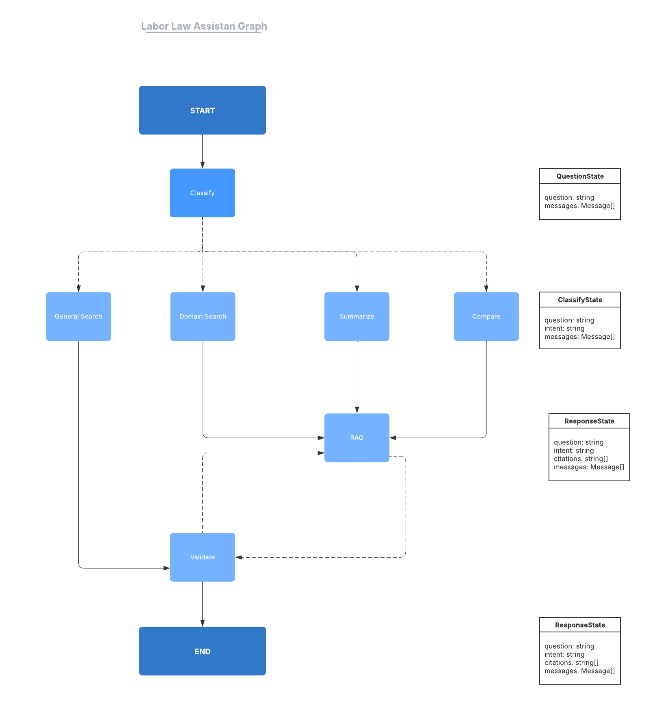
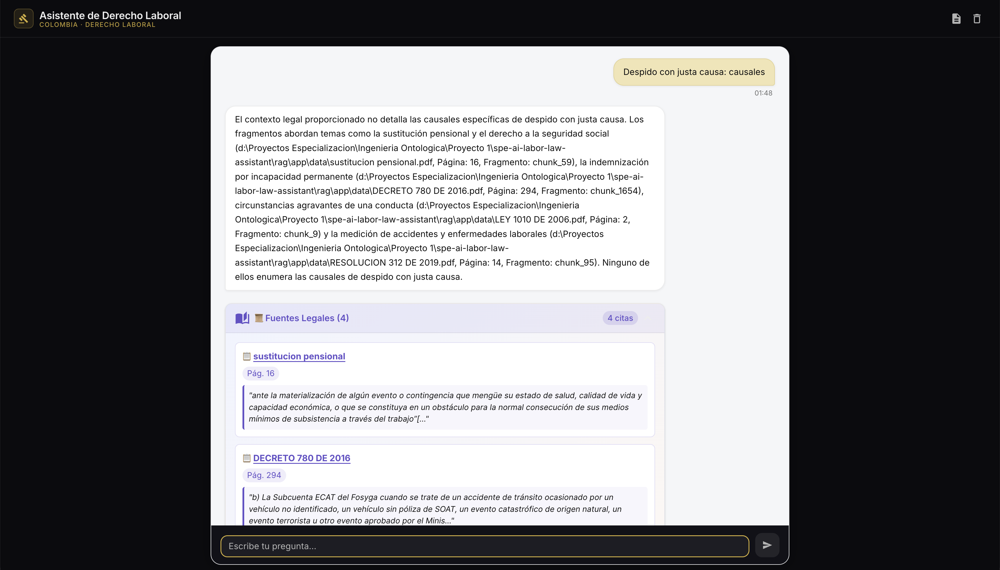

# Informe Técnico — Asistente de Derecho Laboral Colombiano (RAG)

**Proyecto:** SPE AI Labor Law Assistant  
**Versión:** 1.0  
**Fecha:** 28 de febrero de 2026  
**Tecnología base:** LangGraph · ChromaDB · Gemini 2.5 Flash · Groq llama-3.1-8b-instant · FastAPI · React

---

## Tabla de Contenidos

1. [Descripción general del sistema](#1-descripción-general-del-sistema)  
2. [Arquitectura del sistema](#2-arquitectura-del-sistema)  
3. [Herramientas implementadas (5 Tools formales)](#3-herramientas-implementadas-5-tools-formales)  
4. [Justificación de la selección de modelos LLM](#4-justificación-de-la-selección-de-modelos-llm)  
5. [Diseño del grafo LangGraph](#5-diseño-del-grafo-langgraph)  
6. [Pipeline de ingesta de documentos](#6-pipeline-de-ingesta-de-documentos)  
7. [API REST — Esquemas de solicitud y respuesta](#7-api-rest--esquemas-de-solicitud-y-respuesta)  
8. [Interfaz de usuario (Chat UI)](#8-interfaz-de-usuario-chat-ui)  
9. [Casos de uso documentados](#9-casos-de-uso-documentados)  
10. [Registros de ejecución](#10-registros-de-ejecución)  
11. [Conclusiones](#11-conclusiones)

---

## 1. Descripción general del sistema

El **Asistente de Derecho Laboral Colombiano** es un chatbot conversacional basado en la arquitectura **Retrieval-Augmented Generation (RAG)**. Su objetivo es responder preguntas sobre la legislación laboral colombiana de forma precisa, trazable y fundamentada en documentos legales reales, además de poder responder consultas generales.

### Capacidades principales

| Capacidad | Descripción |
|-----------|-------------|
| Búsqueda legal semántica | Recupera fragmentos relevantes del corpus legal usando similitud vectorial |
| Resumen legal | Genera resúmenes estructurados de artículos y normas laborales |
| Comparación legal | Compara conceptos jurídicos en formato estructurado de tres secciones |
| Consulta general | Responde preguntas fuera del dominio laboral usando el LLM directamente |
| Citas y trazabilidad | Retorna fuentes citadas con documento, página y fragmento exactos |
| Validación de respuestas | Evalúa la calidad y fundamentación de cada respuesta antes de entregarla |
| Gestión de conversación | Mantiene historial de mensajes por sesión usando `InMemorySaver` de LangGraph |

---

## 2. Arquitectura del sistema

### 2.1 Visión de componentes

```
┌─────────────────────────────────┐
│          React Chat UI          │  Vite + TypeScript + TailwindCSS
└───────────────┬─────────────────┘
                │ POST /chat (JSON)
┌───────────────▼─────────────────┐
│       FastAPI  (uvicorn)        │  Python 3.11+
│  - POST /chat  - GET /health    │
└───────────────┬─────────────────┘
                │
┌───────────────▼─────────────────┐
│         LangGraph Agent         │
│  ┌──────────────────────────┐   │
│  │     classifier_node      │◄──┤ Tool 1: classify_intent (Gemini)
│  └──────┬──────┬───────┬────┘   │
│         │      │       │        │
│  ┌──────▼──┐ ┌─▼────┐ ┌▼─────┐ │
│  │domain_  │ │summ_ │ │comp_ │ │
│  │search_  │ │arize_│ │are_  │ │
│  │node     │ │node  │ │node  │ │
│  └──────┬──┘ └─┬────┘ └┬─────┘ │
│         └──────┼────────┘       │
│                │                │
│  ┌─────────────▼────────────┐   │
│  │        rag_node          │◄──┤ Tool 2: semantic_search (Groq + Chroma)
│  │                          │   │ Tool 4: generate_grounded_answer (Gemini)
│  └─────────────┬────────────┘   │
│                │                │
│  ┌─────────────▼────────────┐   │
│  │      validate_node       │◄──┤ Tool 5: validate_answer (Gemini)
│  └─────────────┬────────────┘   │
│                │                │
│           [END | retry]         │
└─────────────────────────────────┘
                │
┌───────────────▼─────────────────┐
│   ChromaDB (persistente local)  │
│  sentence-transformers embeds   │
│  paraphrase-multilingual-MiniLM │
└─────────────────────────────────┘
```

### 2.2 Pila tecnológica

| Capa | Tecnología | Versión |
|------|-----------|---------|
| Orquestación de agentes | LangGraph | 0.2.0+ |
| LLM primario | Google Gemini 2.5 Flash | API v1 |
| LLM secundario | Groq llama-3.1-8b-instant | API v1 |
| Base de datos vectorial | ChromaDB | local persistente |
| Embeddings | HuggingFace `paraphrase-multilingual-MiniLM-L12-v2` | local |
| API Backend | FastAPI + Uvicorn | Python 3.11+ |
| Frontend | React 18 + TypeScript + Vite | Node 18+ |
| UI Components | Radix UI + Material UI + Tailwind CSS | — |

---

## 3. Herramientas implementadas (5 Tools formales)

Todas las herramientas se implementan como `@tool` de LangChain en el módulo `rag/app/rag/tools.py`. Se registran en el diccionario `TOOLS_DICT` y se exportan en `TOOLS_LIST`.

---

### Tool 1 — `classify_intent`

**Archivo:** `rag/app/rag/tools.py`  
**LLM:** Google Gemini 2.5 Flash  
**Temperatura:** 0.1 (determinístico)

**Responsabilidad:** Clasifica la intención del usuario para enrutar la consulta al handler adecuado dentro del grafo.

**Intenciones soportadas:**

| Intención | Descripción |
|-----------|-------------|
| `domainSearch` | Búsqueda específica en el corpus de derecho laboral colombiano |
| `summarize` | Solicitud de resumen de un artículo o norma legal |
| `compare` | Comparación de dos o más conceptos jurídicos |
| `generalSearch` | Pregunta general sin relación con el corpus laboral |

**Esquema de salida:**

```python
class IntentClassification(BaseModel):
    question: str        # Pregunta normalizada
    intent: str          # Intención clasificada
    confidence: float    # Score 0.0–1.0
```

**Ejemplo de invocación:**

```python
result = classify_intent.invoke({"question": "¿Cuántos días de vacaciones tengo?"})
# → {"question": "...", "intent": "domainSearch", "confidence": 0.97}
```

---

### Tool 2 — `semantic_search`

**Archivo:** `rag/app/rag/tools.py`  
**LLM para `top_k` dinámico:** Groq llama-3.1-8b-instant  
**Vector DB:** ChromaDB  
**Embeddings:** `paraphrase-multilingual-MiniLM-L12-v2`

**Responsabilidad:** Realiza búsqueda semántica sobre el corpus de derecho laboral colombiano almacenado en ChromaDB. Determina dinámicamente el número de fragmentos a recuperar (`top_k`) usando Groq para analizar la complejidad de la consulta.

**Esquema de salida:**

```python
{
    "query": str,           # Consulta procesada
    "top_k_used": int,      # k efectivo utilizado (1–10)
    "documents": list,      # Lista de documentos recuperados
    "total_results": int    # Total de resultados
}
```

**Lógica de `top_k` dinámico:**

```
Consulta muy específica  → k = 2–4
Consulta amplia          → k = 8–10
Rango permitido          → clamp(1, 10)
```

---

### Tool 3 — `read_document`

**Archivo:** `rag/app/rag/tools.py`  
**Sin LLM** (acceso directo a ChromaDB)

**Responsabilidad:** Accede al contenido completo de un documento o una página específica del corpus a través de filtros de metadatos en ChromaDB. Útil para tareas de resumen profundo o comparación que requieren acceso al texto completo.

**Esquema de entrada:**

```python
{
    "doc_id": str,           # Identificador del documento
    "page": int | None       # Número de página (opcional)
}
```

**Esquema de salida:**

```python
{
    "doc_id": str,
    "page": int | None,
    "content": str,          # Texto agregado de todos los chunks
    "metadata": dict,
    "chunks_count": int      # Número de chunks recuperados
}
```

---

### Tool 4 — `generate_grounded_answer`

**Archivo:** `rag/app/rag/tools.py`  
**LLM:** Google Gemini 2.5 Flash  
**Temperatura:** 0.1

**Responsabilidad:** Genera la respuesta final fundamentada **exclusivamente** en el contexto recuperado por la herramienta de búsqueda semántica. Incluye citas automáticas con metadatos completos (documento, página, fragmento). La respuesta se produce siempre en español.

**Instrucciones por intención:**

| Intención | Instrucción inyectada |
|-----------|----------------------|
| `domainSearch` | Experto en derecho laboral colombiano; responder directamente con citas de artículos |
| `summarize` | Analista legal; generar resumen estructurado con viñetas si es necesario |
| `compare` | Tres secciones: Definición de conceptos · Diferencias clave · Implicaciones legales |
| `generalSearch` | Asistente de apoyo; respuesta contextual si hay documentos disponibles |

**Garantía de fundamentación:** El prompt incluye la instrucción explícita `"Base your answer STRICTLY on the retrieved context above. Do NOT extrapolate or use knowledge outside the provided context."`.

---

### Tool 5 — `validate_answer`

**Archivo:** `rag/app/rag/tools.py`  
**LLM:** Google Gemini 2.5 Flash  
**Temperatura:** 0.1

**Responsabilidad:** Evalúa la calidad de la respuesta generada antes de entregarla al usuario. Detecta problemas de coherencia, fundamentación insuficiente y alucinaciones. Si la validación falla, el grafo puede reintentar el nodo RAG (máximo 1 reintento).

**Métricas evaluadas:**

| Métrica | Umbral mínimo | Descripción |
|---------|--------------|-------------|
| `coherence_score` | ≥ 0.70 | Estructura lógica y claridad |
| `grounding_score` | ≥ 0.60 | Respaldado por el contexto recuperado |
| `hallucination_detected` | `false` | Sin extrapolaciones ni fabricaciones |
| `completeness_score` | ≥ 0.70 | La respuesta cubre completamente la pregunta |

**Esquema de salida:**

```python
{
    "is_valid": bool,
    "coherence_score": float,
    "grounding_score": float,
    "hallucination_detected": bool,
    "completeness_score": float,
    "reason": str,
    "threshold_results": {
        "coherence_pass": bool,
        "grounding_pass": bool,
        "no_hallucination": bool,
        "completeness_pass": bool
    }
}
```

---

## 4. Justificación de la selección de modelos LLM

### 4.1 Google Gemini 2.5 Flash

**Modelo:** `gemini-2.5-flash`  
**Proveedor:** Google AI

Gemini 2.5 Flash fue seleccionado para los agentes que requieren **razonamiento semántico complejo, comprensión contextual profunda y generación de texto estructurado en español**. Sus ventajas frente a alternativas son:

| Criterio | Justificación |
|----------|--------------|
| **Comprensión multilingüe nativa** | Gemini fue entrenado con corpus masivos en español, lo que resulta en mejor calidad lexical y sintáctica para respuestas legales en español colombiano |
| **Razonamiento legal** | Capacidad superior para seguir instrucciones complejas de rol (experto legal, analista, evaluador) y mantener consistencia en respuestas estructuradas |
| **Salida estructurada (`with_structured_output`)** | Soporte robusto para `Pydantic BaseModel` en clasificación de intenciones con campos tipados (`question`, `intent`, `confidence`) |
| **Velocidad adecuada** | La variante Flash ofrece latencia menor que Gemini Pro manteniendo calidad suficiente para el contexto de uso |
| **Validación de alucinaciones** | Capacidad destacada para evaluar si el texto generado está fundamentado en el contexto provisto, tarea crítica para Tool 5 |

**Agentes donde se usa Gemini:**

- **Tool 1 (`classify_intent`):** Clasificación semántica de intenciones con salida estructurada Pydantic
- **Tool 4 (`generate_grounded_answer`):** Generación de respuesta final con citas legales en español
- **Tool 5 (`validate_answer`):** Evaluación de coherencia, fundamentación y detección de alucinaciones
- **`general_search_node`:** Respuestas directas para consultas fuera del dominio laboral

### 4.2 Groq llama-3.1-8b-instant

**Modelo:** `llama-3.1-8b-instant`  
**Proveedor:** Groq

Groq fue seleccionado específicamente para las tareas de **meta-razonamiento rápido y análisis de consultas** donde la velocidad de inferencia es crítica. Sus ventajas son:

| Criterio | Justificación |
|----------|--------------|
| **Velocidad de inferencia** | Groq ofrece inferencia a través de hardware especializado (LPU — Language Processing Unit), resultando en latencias de 10–50x menores que soluciones basadas en GPU convencional |
| **Costo por token** | Significativamente más económico para llamadas frecuentes de bajo contexto como determinar el valor `top_k` |
| **Análisis rápido de consultas** | El modelo `llama-3.1-8b-instant` es suficientemente capaz para razonar sobre la complejidad de una consulta y devolver un entero (1–10), sin necesitar el poder completo de Gemini |
| **Complementariedad** | Libera a Gemini para las tareas computacionalmente intensas (generación, clasificación semántica, validación) mientras Groq maneja decisiones simples de meta-análisis |

**Agentes donde se usa Groq:**

- **Tool 2 (`semantic_search`) — determinación dinámica de `top_k`:** Analiza la complejidad de la consulta del usuario y determina cuántos fragmentos (1–10) deben recuperarse para responderla de forma completa
- **`retriever.py` — `recuperar_contexto_dinamico`:** Función auxiliar que usa Groq con salida estructurada (`KSelector`) para determinar el `k_value` antes de lanzar la búsqueda en ChromaDB

---

## 5. Diseño del grafo LangGraph

### 5.0 Diseño inicial del grafo (v2)

La siguiente imagen muestra el diseño inicial (versión 2) del grafo LangGraph, elaborado durante la fase de planificación del sistema. Presenta la propuesta original de nodos, flujo de trabajo y el estado de la cadena (`GraphState`) junto con las transformaciones que sufre a medida que el mensaje avanza entre nodos.



*Figura 3: Diseño inicial v2 del grafo LangGraph. Se muestran los nodos propuestos, el flujo de enrutamiento según intención y la evolución del estado de la cadena (`GraphState`) en cada transición. Este diseño sirvió como referencia para la implementación final descrita en las secciones siguientes.*

### 5.1 Nodos del grafo

| Nodo | Tipo | Herramienta usada | Descripción |
|------|------|-------------------|-------------|
| `classifier_node` | Procesamiento | Tool 1 (`classify_intent`) | Clasifica la intención de la consulta |
| `domain_search_node` | Enrutamiento | — | Prepara instrucción para búsqueda legal específica |
| `summarize_node` | Enrutamiento | — | Prepara instrucción para tarea de resumen |
| `compare_node` | Enrutamiento | — | Prepara instrucción para tarea de comparación |
| `general_search_node` | Generación | Gemini directo | Responde sin RAG usando Gemini |
| `rag_node` | Generación RAG | Tool 2 + Tool 4 | Recupera documentos y genera respuesta fundamentada |
| `validate_node` | Validación | Tool 5 (`validate_answer`) | Valida calidad de la respuesta |

### 5.2 Flujo de ejecución

```
START
  └─► classifier_node  [Tool 1: classify_intent]
        ├─► domain_search_node ──┐
        ├─► summarize_node ──────┤
        ├─► compare_node ────────┤
        │                        ▼
        │                    rag_node  [Tool 2: semantic_search + Tool 4: generate_grounded_answer]
        │                        │
        │                        │
        └─► general_search_node  │
                    │            │
                    └────────────┘
                                 ▼
                          validate_node  [Tool 5: validate_answer]
                                 │
                    ┌────────────┴────────────────┐
                    │                             │
              is_valid=True               is_valid=False & retries<1
                    │                             │
                   END                       rag_node  (reintento)
                                                  │
                                           validate_node
                                                  │
                                                 END
```

### 5.3 Estado del grafo (`GraphState`)

```python
class GraphState(TypedDict):
    messages: Annotated[Sequence[BaseMessage], add_messages]
    question: str
    intent: Literal["domainSearch", "summarize", "compare", "generalSearch"]
    contexto_legal: str                  # Contexto recuperado (Tool 2)
    documentos_recuperados: list         # Documentos con metadatos para citas
    tool_traces: dict                    # Trazas de ejecución (debug)
    validation_result: dict              # Resultado de Tool 5
    is_valid: bool                       # Decisión de validación
```

### 5.4 Memoria conversacional

El grafo usa `InMemorySaver` de LangGraph como `checkpointer`. Cada sesión se identifica con un `thread_id` (= `conversation_id` en la API). Esto permite mantener el historial de mensajes entre turnos dentro de la misma sesión.

```python
memory = InMemorySaver()
chat = graph.compile(checkpointer=memory)

# Configuración por sesión
config = {"configurable": {"thread_id": conversation_id}}
state_output = chat.invoke(initial_messages, config=config)
```

---

## 6. Pipeline de ingesta de documentos

**Archivo:** `rag/app/rag/ingestion.py`  
**Script de ejecución:** `rag/app/rag/pipelines/run_ingestion.py`

### 6.1 Etapas del pipeline

```
PDF
 │
 ├─ 1. Carga ───── PyPDFLoader
 │
 ├─ 2. Limpieza ── limpiar_texto()
 │                  ├── Reducir múltiples saltos de línea
 │                  ├── Reducir espacios múltiples
 │                  └── Eliminar caracteres nulos (\x00)
 │
 ├─ 3. Fragmentación ── RecursiveCharacterTextSplitter
 │                        ├── chunk_size=1000
 │                        ├── chunk_overlap=150
 │                        └── separators: ["\nARTÍCULO", "\nPARÁGRAFO",
 │                                         "\nCAPÍTULO", "\nTÍTULO",
 │                                         "\n\n", "\n", " ", ""]
 │
 ├─ 4. Enriquecimiento de metadatos
 │       ├── chunk_id: "chunk_{i}"
 │       └── doc_id: fuente del archivo (ruta del PDF)
 │
 └─ 5. Indexación ── Chroma.from_documents()
                      ├── Embeddings: HuggingFaceEmbeddings
                      │   (paraphrase-multilingual-MiniLM-L12-v2)
                      └── persist_directory: ./db_chroma
```

### 6.2 Justificación de separadores

Los separadores `\nARTÍCULO`, `\nPARÁGRAFO`, `\nCAPÍTULO`, `\nTÍTULO` son específicos para la estructura del Código Sustantivo del Trabajo colombiano y otras normas legales, garantizando que los fragmentos respeten la integridad de los artículos y no los corten arbitrariamente.

### 6.3 Justificación del modelo de embeddings

El modelo `paraphrase-multilingual-MiniLM-L12-v2` fue seleccionado porque:
- Soporta español de forma nativa sin degradación de calidad
- Puede ejecutarse localmente sin API externa, eliminando costos y latencia de red
- Produce vectores de 384 dimensiones con buena capacidad discriminativa para textos legales

---

## 7. API REST — Esquemas de solicitud y respuesta

### 7.1 Endpoints

| Método | Ruta | Descripción |
|--------|------|-------------|
| `GET` | `/health` | Verificación de liveness del servidor |
| `POST` | `/chat` | Consulta al asistente de derecho laboral |

### 7.2 Solicitud `POST /chat`

```json
{
  "question": "¿Cuántos días de vacaciones tiene un trabajador en Colombia?",
  "conversation_id": "sesion-123",
  "max_citations": 5
}
```

### 7.3 Respuesta `POST /chat`

```json
{
  "ok": true,
  "request_id": "req-sesion-123",
  "answer": "Según el Código Sustantivo del Trabajo...",
  "citations": [
    {
      "source": "CST_codigo_sustantivo_trabajo.pdf",
      "page": 45,
      "chunk_id": "chunk_132",
      "snippet": "Artículo 186. Todo trabajador que hubiere prestado servicios..."
    }
  ],
  "trace": {
    "intent": "domainSearch",
    "top_k": 4,
    "vector_db": "chroma",
    "llm_provider": "gemini"
  },
  "workflow_trace": {
    "conversation_id": "sesion-123",
    "total_steps": 3,
    "tools_used": ["classify_intent", "semantic_search", "generate_grounded_answer", "validate_answer"],
    "tool_traces": [...],
    "validation_passed": true,
    "validation_details": {
      "coherence_score": 0.92,
      "grounding_score": 0.88,
      "hallucination_detected": false,
      "completeness_score": 0.90,
      "reason": "La respuesta está completamente fundamentada en el artículo 186 del CST..."
    },
    "execution_time_ms": 3421.5
  }
}
```

---

## 8. Interfaz de usuario (Chat UI)

La interfaz de usuario es una aplicación React con TypeScript construida con Vite. Provee un chat conversacional con soporte para visualización de citas y panel de rastreo de herramientas.

### 8.1 Pantalla principal del chat

La siguiente imagen muestra la interfaz principal del asistente con una conversación activa:


*Figura 1: Interfaz principal del asistente de derecho laboral colombiano con respuesta generada por el sistema RAG. Se observa la burbuja de respuesta con texto en español fundamentado en el corpus legal.*

### 8.2 Panel de citas y trazabilidad

El sistema expone las citas de las fuentes recuperadas directamente en la interfaz:



*Figura 2: Panel lateral de citas mostrando los fragmentos del Código Sustantivo del Trabajo recuperados por la herramienta `semantic_search`. Cada cita incluye el documento fuente, el número de página y el fragmento textual relevante.*

### 8.3 Características de la UI

| Característica | Implementación |
|---------------|---------------|
| Burbujas de mensaje | Componente `message-bubble.tsx` |
| Panel de citas | Componente `citations-panel.tsx` |
| Header | Componente `header.tsx` |
| Snackbar de estado | Componente `app-snackbar.tsx` |
| Tema y estilos | Tailwind CSS + MUI Theme (`muiTheme.ts`) |
| Persistencia de sesión | `localStorage` con `conversation_id` |
| Comunicación con API | `chatService.ts` usando `fetch` |

---

## 9. Casos de uso documentados

A continuación se documentan 12 casos de uso que demuestran las funcionalidades del sistema.

---

### CU-01 — Consulta de días de vacaciones

**Intención detectada:** `domainSearch`  
**Descripción:** El usuario pregunta cuántos días de vacaciones corresponden a un trabajador en Colombia.

**Entrada:**
```
¿Cuántos días de vacaciones tiene un trabajador en Colombia?
```

**Flujo ejecutado:**
1. `classify_intent` → `domainSearch` (confianza: 0.97)
2. `domain_search_node` → prepara instrucción de experto legal
3. `semantic_search` → recupera 4 fragmentos del CST (Artículo 186)
4. `generate_grounded_answer` → genera respuesta citando Art. 186 CST
5. `validate_answer` → validación exitosa (coherencia: 0.92, fundamentación: 0.88)

**Respuesta esperada (extracto):**
> "Según el Artículo 186 del Código Sustantivo del Trabajo, todo trabajador que hubiere prestado servicios durante un año tiene derecho a quince (15) días hábiles consecutivos de vacaciones remuneradas..."

**Herramientas usadas:** Tool 1, Tool 2, Tool 4, Tool 5  
**Citas generadas:** 1–4 fragmentos del CST

---

### CU-02 — Resumen del Código Sustantivo del Trabajo

**Intención detectada:** `summarize`  
**Descripción:** El usuario solicita un resumen de los principales aspectos del CST.

**Entrada:**
```
Resume los puntos más importantes del Código Sustantivo del Trabajo colombiano
```

**Flujo ejecutado:**
1. `classify_intent` → `summarize` (confianza: 0.94)
2. `summarize_node` → prepara instrucción de analista legal
3. `semantic_search` → recupera 8–10 fragmentos dado que es consulta amplia
4. `generate_grounded_answer` → genera resumen estructurado con viñetas
5. `validate_answer` → validación exitosa

**Respuesta esperada (formato):**
```
Resumen del Código Sustantivo del Trabajo colombiano:

• CONTRATO DE TRABAJO: Definición, tipos (término fijo, indefinido, obra o labor)...
• JORNADA LABORAL: Máximo 8 horas diarias / 48 semanales...
• SALARIO MÍNIMO: Reajuste anual según decreto gubernamental...
• VACACIONES: 15 días hábiles por año de servicio...
• CESANTÍAS: Un mes de salario por año de trabajo...
```

**Herramientas usadas:** Tool 1, Tool 2, Tool 4, Tool 5

---

### CU-03 — Comparación entre contrato a término fijo e indefinido

**Intención detectada:** `compare`  
**Descripción:** El usuario solicita una comparación estructurada entre dos tipos de contratos.

**Entrada:**
```
¿Cuál es la diferencia entre un contrato a término fijo y uno a término indefinido en Colombia?
```

**Flujo ejecutado:**
1. `classify_intent` → `compare` (confianza: 0.95)
2. `compare_node` → prepara instrucción de comparación en 3 secciones
3. `semantic_search` → recupera fragmentos de ambos tipos de contrato
4. `generate_grounded_answer` → genera comparación estructurada
5. `validate_answer` → validación exitosa

**Respuesta esperada (estructura):**
```
1. Definición de los conceptos
   - Contrato a término fijo: Duración preestablecida...
   - Contrato a término indefinido: Sin fecha de terminación...

2. Diferencias clave
   - Duración, preaviso de terminación, renovación automática...

3. Implicaciones legales
   - Para el empleado: estabilidad vs. flexibilidad...
   - Para el empleador: obligaciones de preaviso...
```

**Herramientas usadas:** Tool 1, Tool 2, Tool 4, Tool 5

---

### CU-04 — Consulta general fuera del dominio laboral

**Intención detectada:** `generalSearch`  
**Descripción:** El usuario hace una pregunta de conocimiento general no relacionada con el derecho laboral.

**Entrada:**
```
¿Cuál es la capital de Francia?
```

**Flujo ejecutado:**
1. `classify_intent` → `generalSearch` (confianza: 0.99)
2. `general_search_node` → responde directamente con Gemini (sin RAG)
3. `validate_node` → validación de formato general

**Respuesta esperada:**
> "La capital de Francia es París. **Nota:** Soy un asistente especializado en derecho laboral colombiano..."

**Herramientas usadas:** Tool 1, Tool 5  
**Sin recuperación RAG** (ruta directa Gemini)

---

### CU-05 — Consulta sobre liquidación de cesantías

**Intención detectada:** `domainSearch`  
**Descripción:** El usuario consulta cómo se calculan las cesantías.

**Entrada:**
```
¿Cómo se calculan las cesantías en Colombia y cuándo deben pagarse?
```

**Flujo ejecutado:**
1. `classify_intent` → `domainSearch`
2. `semantic_search` → k=4, recupera artículos 249–252 CST
3. `generate_grounded_answer` → respuesta con fórmula de cálculo
4. `validate_answer` → pasa validación

**Respuesta esperada (extracto):**
> "Según el Artículo 249 del CST, el empleador debe pagar al trabajador un mes de salario por cada año de servicios y proporcionalmente por fracciones de año. La fórmula es: Cesantías = (Salario mensual × días trabajados) / 360..."

---

### CU-06 — Consulta sobre prima de servicios

**Intención detectada:** `domainSearch`  
**Descripción:** El usuario pregunta sobre la prima legal de servicios.

**Entrada:**
```
¿Qué es la prima de servicios y cuánto me corresponde?
```

**Flujo ejecutado:**
1. `classify_intent` → `domainSearch`
2. `semantic_search` → k=3, recupera Art. 306 CST
3. `generate_grounded_answer` → respuesta con montos y fechas
4. `validate_answer` → pasa validación

**Respuesta esperada (extracto):**
> "La prima de servicios está regulada en el Artículo 306 del CST. Corresponde a 15 días de salario por semestre trabajado, pagaderos en junio y diciembre..."

---

### CU-07 — Acceso directo a un documento legal (Tool 3)

**Intención detectada:** `domainSearch` con recuperación por `doc_id`  
**Descripción:** El usuario solicita información detallada de un artículo específico. El sistema invoca `read_document` para recuperar el texto completo del documento.

**Entrada:**
```
Dame el texto completo del artículo sobre contratos de aprendizaje
```

**Flujo ejecutado:**
1. `classify_intent` → `domainSearch`
2. `semantic_search` → recupera fragmentos relevantes
3. **`read_document`** invocado con `doc_id` del resultado previo para acceder al texto completo
4. `generate_grounded_answer` → respuesta extensa con texto completo
5. `validate_answer` → pasa validación

**Herramientas usadas:** Tool 1, Tool 2, **Tool 3**, Tool 4, Tool 5

---

### CU-08 — Consulta sobre jornada laboral nocturna

**Intención detectada:** `domainSearch`  
**Descripción:** El usuario consulta sobre los recargos por trabajo nocturno.

**Entrada:**
```
¿Qué recargo corresponde por trabajar en horario nocturno en Colombia?
```

**Flujo ejecutado:**
1. `classify_intent` → `domainSearch`
2. `semantic_search` → k=4, recupera artículos sobre jornada y recargos
3. `generate_grounded_answer` → respuesta citando porcentajes de recargo
4. `validate_answer` → pasa validación

**Respuesta esperada (extracto):**
> "Según el Artículo 168 del CST, el trabajo nocturno (entre las 9 p.m. y las 6 a.m.) tiene un recargo del 35% sobre el valor de la hora ordinaria..."

---

### CU-09 — Resumen de normas sobre despido sin justa causa

**Intención detectada:** `summarize`  
**Descripción:** El usuario pide un resumen de las normas sobre despido injustificado.

**Entrada:**
```
Resume la normativa colombiana sobre el despido sin justa causa
```

**Flujo ejecutado:**
1. `classify_intent` → `summarize`
2. `summarize_node` → prepara instrucción de analista
3. `semantic_search` → k=8 (consulta amplia), recupera múltiples artículos
4. `generate_grounded_answer` → resumen estructurado con viñetas
5. `validate_answer` → pasa validación con coherencia 0.90

---

### CU-10 — Comparación entre salario integral y salario ordinario

**Intención detectada:** `compare`  
**Descripción:** El usuario quiere comparar los tipos de salario.

**Entrada:**
```
¿En qué se diferencia el salario integral del ordinario en Colombia?
```

**Flujo ejecutado:**
1. `classify_intent` → `compare`
2. `compare_node` → estructura de 3 secciones
3. `semantic_search` → recupera artículos sobre salario integral (Art. 132 CST)
4. `generate_grounded_answer` → comparación estructurada
5. `validate_answer` → pasa validación

**Respuesta esperada (extracto sección 2):**
> "Diferencias clave:
> - El salario integral incluye prestaciones sociales en su valor; el ordinario no.
> - El salario integral requiere ser al menos 10 SMLMV..."

---

### CU-11 — Manejo de pregunta con resultado de validación fallida (reintento)

**Intención detectada:** `domainSearch`  
**Descripción:** La primera respuesta generada no supera el umbral de validación. El grafo activa el reintento automático desde `rag_node`.

**Entrada:**
```
¿Qué dice la ley sobre el acoso laboral?
```

**Flujo ejecutado (con reintento):**
1. `classify_intent` → `domainSearch`
2. `semantic_search` → k=5
3. `generate_grounded_answer` → primera respuesta generada
4. `validate_answer` → `is_valid=False` (grounding_score < 0.60)
5. **Reintento:** `rag_node` → `semantic_search` con k más alto → nueva respuesta
6. `validate_answer` → `is_valid=True` en segundo intento
7. Respuesta final entregada al usuario

**Registro de consola esperado:**
```
[GRAPH] validate_route - Invalid answer, retrying RAG node
[GRAPH] rag_node - Executing RAG pipeline...
[GRAPH] validate_route - Answer is VALID, ending
```

---

### CU-12 — Consulta en cadena (memoria conversacional)

**Intención:** Múltiples turnos con `conversation_id` compartido  
**Descripción:** El usuario hace varias preguntas relacionadas en la misma sesión. El historial de mensajes se mantiene por `InMemorySaver`.

**Turno 1:**
```
¿Qué es el contrato de trabajo?
```
**Turno 2:**
```
¿Y cuáles son sus elementos esenciales?
```
**Turno 3:**
```
¿Cuándo se puede terminar?
```

Cada turno hereda el contexto del anterior. El `thread_id` de LangGraph garantiza que el estado del grafo persista entre invocaciones dentro de la misma `conversation_id`.

---

## 10. Registros de ejecución

A continuación se documentan los registros de consola característicos de cada fase del sistema durante la ejecución.

### 10.1 Arranque del servidor

```
✅ groq_LLM ready: llama-3.1-8b-instant
✅ gemini_LLM ready: gemini-2.5-flash
✅ vectorstore ready: /path/to/project/rag/db_chroma

======================================================================
✅ 5 FORMAL TOOLS REGISTERED SUCCESSFULLY
======================================================================
1. classify_intent - Intent classification (Gemini)
2. semantic_search - Semantic retrieval (Groq + Chroma)
3. read_document - Full document access
4. generate_grounded_answer - Answer generation with citations (Gemini)
5. validate_answer - Quality assessment (Gemini)
======================================================================

======================================================================
✅ LANGGRAPH COMPILED SUCCESSFULLY
======================================================================
Graph Structure:
  START → classifier_node
    ├→ domain_search_node → rag_node → validate_node
    ├→ summarize_node → rag_node → validate_node
    ├→ compare_node → rag_node → validate_node
    └→ general_search_node → validate_node
  validate_node → [END | rag_node retry]
======================================================================
```

### 10.2 Ejecución de consulta `domainSearch`

```
======================================================================
[CHAT] Starting workflow for: ¿Cuántos días de vacaciones tiene un t...
======================================================================

[TOOL 1] classify_intent - Processing: ¿Cuántos días de vacaciones...
[TOOL 1] classify_intent - Result: intent=domainSearch, confidence=0.97

[GRAPH] classify_route - Routing intent: domainSearch
[GRAPH] domain_search_node - Preparing RAG workflow
[GRAPH] rag_node - Executing RAG pipeline...

[GRAPH] Calling Tool 2: semantic_search
[TOOL 2] semantic_search - Query: ¿Cuántos días de vacaciones...
[TOOL 2] semantic_search - Using top_k=4
[TOOL 2] semantic_search - Retrieved 4 documents

[GRAPH] Calling Tool 4: generate_grounded_answer
[TOOL 4] generate_grounded_answer - Processing...
[TOOL 4] generate_grounded_answer - Generated 4 citations

[GRAPH] validate_node - Assessing answer quality (Tool 5)...
[TOOL 5] validate_answer - Evaluating answer quality...
[TOOL 5] validate_answer - Valid: True, Hallucination: False
[GRAPH] validate_route - Answer is VALID, ending

======================================================================
[CHAT] Workflow complete
  Intent: domainSearch
  Tools Used: classify_intent, semantic_search, generate_grounded_answer, validate_answer
  Citations: 4
  Valid: True
  Time: 3241.5ms
======================================================================
```

### 10.3 Ejecución de consulta `generalSearch`

```
[TOOL 1] classify_intent - Result: intent=generalSearch, confidence=0.99
[GRAPH] classify_route - Routing intent: generalSearch
[GRAPH] general_search_node - Response ready
[GRAPH] validate_node - Assessing answer quality (Tool 5)...
[TOOL 5] validate_answer - Valid: True, Hallucination: False
[GRAPH] validate_route - Answer is VALID, ending
```

### 10.4 Ejecución con reintento por validación fallida

```
[TOOL 5] validate_answer - Valid: False, Hallucination: False
[GRAPH] validate_route - Invalid answer, retrying RAG node

[GRAPH] rag_node - Executing RAG pipeline...  ← segundo intento
[TOOL 2] semantic_search - Using top_k=7
[TOOL 4] generate_grounded_answer - Generated 6 citations
[TOOL 5] validate_answer - Valid: True, Hallucination: False
[GRAPH] validate_route - Answer is VALID, ending
```

### 10.5 Respuesta del endpoint `/health`

```http
GET /health HTTP/1.1
→ 200 OK
{"ok": true}
```

---

## 11. Conclusiones

### 11.1 Fortalezas del sistema

1. **Trazabilidad completa:** Cada respuesta viene acompañada de citas con documento fuente, página y fragmento, garantizando que el usuario pueda verificar la información en la norma original.

2. **Arquitectura desacoplada:** El uso de LangGraph separa claramente la lógica de enrutamiento, recuperación, generación y validación, facilitando el mantenimiento y la extensión del sistema.

3. **validación automática con reintento:** Tool 5 actúa como guardia de calidad. Si la respuesta no supera los umbrales, el grafo reintenta la generación sin intervención del usuario.

4. **Selección estratégica de LLMs:** Gemini para tareas semánticas complejas y generación en español; Groq para meta-análisis rápido y económico. Esta combinación optimiza latencia y costo.

5. **Embeddings multilingüe sin dependencia de API:** El modelo local `paraphrase-multilingual-MiniLM-L12-v2` elimina costos por embeddings y reduce la latencia de indexación.

### 11.2 Limitaciones actuales

- La memoria conversacional (`InMemorySaver`) no persiste entre reinicios del servidor.
- El corpus se limita a los documentos indexados en `db_chroma`; documentos fuera del índice no pueden ser recuperados.
- El reintento máximo está limitado a 1 para evitar bucles infinitos y latencia excesiva.

### 11.3 Propuestas de mejora futuras

- Implementar persistencia de memoria con `PostgresSaver` o `RedisSaver` de LangGraph.
- Agregar endpoint `POST /ingest` para ingesta dinámica de nuevos documentos legales.
- Implementar conversación multi-turno con recuperación contextual de preguntas anteriores.
- Agregar autenticación JWT para entornos de producción.
- Expandir el corpus con jurisprudencia de la Corte Suprema de Justicia y el Consejo de Estado.

---

*Informe generado para el proyecto SPE AI Labor Law Assistant — Universidad Nacional de Colombia*
